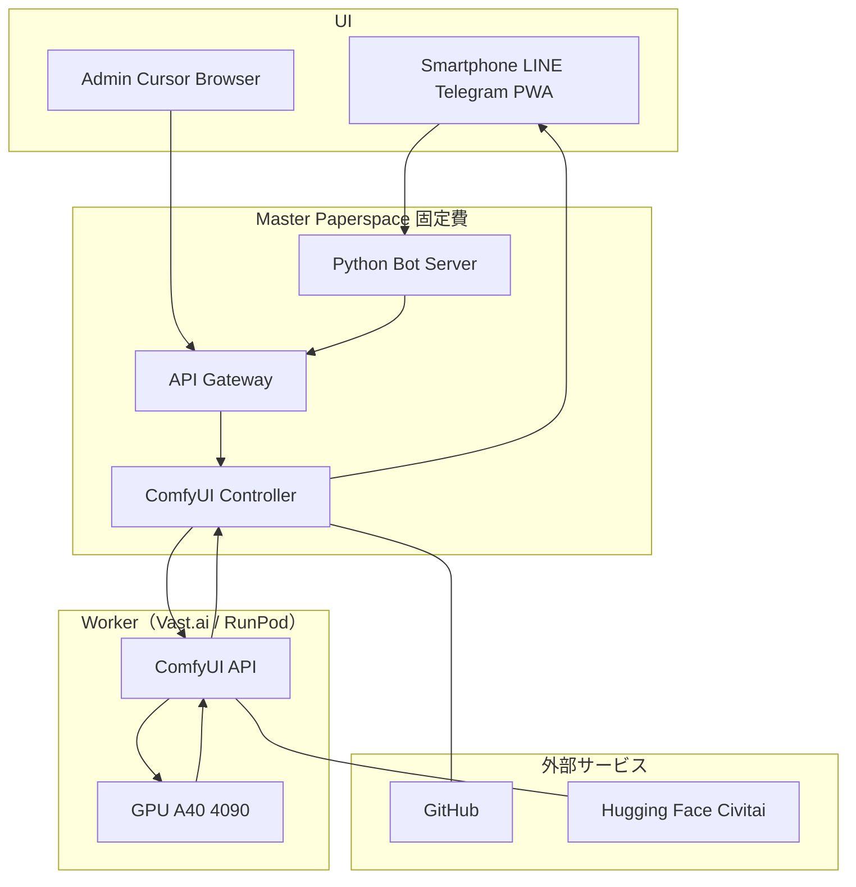

# 低コストなAI動画生成環境の構築ロードマップ

## 構築の背景

最近、YouTubeやSNSでハイクオリティなAI動画をよく見かける。自分でも作りたいが、商用サービスは表現の規制やコストの面で不自由なのが実情である。

初期投資を抑えつつ「無規制」な環境を作るため、クラウドの余剰リソースを活用する。構築を通じて、最新のクラウド開発と**「バイブコーディング」から「AIエージェント活用」への変遷**を体験する。

---

## システム要件

以下の条件をゴールとして設定する。

### 1. 最終的なサービス提供イメージ（UI/UX）

- **スマホ対応**: スマートフォンからテキストや画像を送付するだけで動画生成が開始される仕組み
- **インターフェース**: メッセージングボット（LINE/Telegram等）または軽量なWeb UI（PWA）を介した操作
- **役割分担**: ComfyUIは「生成エンジン」、MasterノードのPythonが「UI/ボットサーバー」を担う
- **進捗通知**: 生成完了をスマホにプッシュ通知、または即座にプレビュー・保存が可能

### 2. ターゲット動画スペック

| 項目 | 内容 |
|------|------|
| **入力形式** | テキスト（T2V）および画像（I2V）の両方に対応 |
| **解像度** | 2K（2560×1440）以上 |
| **長さ** | 30秒以上 |
| **生成時間** | 10分以内（アップスケール処理等を含む / 現状は相場観が不明なため仮置きの目標値とする） |
| **将来構想** | VR動画（180度/360度 3D）の生成対応 |

### 3. コストとスケーラビリティ

- 数十万円のハードウェア投資を避け、月額ベースの運用を実現する
- **役割の分離**: 思考・開発（定額）と、高負荷計算（従量）を分けることで無駄な課金を防ぐ

### 4. 表現の自由度

- オープンソースモデルを活用し、商用サービスのプロンプト規制を受けない環境を構築する

### 5. 最新開発手法の実踐と汎用スキルの獲得

- **現状**: AIエージェントサービスを試用した程度の段階からスタート
- **AIエージェントの活用**: Cursor Agentや自律型エージェント（OpenHands等）を開発の中核に据える
- Docker、API連携、クラウドインフラ管理の知識を習得する
- AIエージェントと対話しながら爆速で開発を進める**「バイブコーディング」**を実践する

---

## システムパターンの比較と選択

動画生成環境の構築には主に以下の4パターンがあるが、本プロジェクトでは**「④ Master-Worker構成」**を選択する。

| パターン | メリット | デメリット | 採用理由 |
|----------|----------|------------|----------|
| ① ローカルPC型 | ランニングコスト最小 | 初期投資が極めて高い | 投資リスク回避のため見送り |
| ② 単一クラウド型 | 環境構築がシンプル | 思考中も高額課金される | バイブコーディングに不向き |
| ③ Master-Worker | 開発（定額）と生成（従量）を分離 | 構築に技術が必要 | コストと学習効率が最高 |
| ④ **結論** | **Master-Worker構成（低価格・高効率の最適解）** | — | Paperspace（開発用・固定費）と Vast.ai / RunPod（生成用・従量課金）を組み合わせる |

---

## 用語解説

- **Paperspace（by DigitalOcean）**: 開発拠点（Master）。月額固定$8。ボットサーバーやAPI Gatewayもここで稼働させる
- **Vast.ai / RunPod**: 実行機（Worker）。計算時のみ時給で借りる最強GPU
- **API連携（WebSocket/JSON）**: ComfyUIの「設計図」をJSONで送り込む手法。ボットからの命令をWorkerへ橋渡しする核
- **AIエージェント**: 開発後半の複雑なボット連携や分散処理の実装を自律的に担うパートナー

---

## アーキテクチャ図

スマホをフロントエンドに据えた全体像。**UI / Master / Worker / 外部サービス**の4つに整理する。

> **プレビューで図が表示されない場合**: [Markdown Preview Mermaid Support](https://marketplace.visualstudio.com/items?itemName=bierner.markdown-mermaid) 拡張または [Mermaid Live Editor](https://mermaid.live/) で確認できます。

---

## 構築フェーズ

### Phase 1: 開発拠点の固定（バイブコーディング期）

- Paperspace上にDocker環境をデプロイし、ComfyUIを安定稼働させる
- **ポータビリティの確保**: すべての設定を `docker-compose.yml` に集約し、将来のPF移行を容易にする
- VS Code Remote Tunnelsを利用し、ローカルのCursorからセキュアな開発環境を確保する

### Phase 2: GUI習得とAPI自動化（バイブコーディング期）

- **GUIトレーニング**: ノードの繋ぎ方、モデルのロード、画像生成の基本フローをGUI上で練習
- **API書き出し手法**: GUIで組んだワークフローを「API Format JSON」として出力する手順の習得
- **Python連携**: 書き出したJSONをPython経由でWorkerに送信し、結果を受け取る基礎コードの実装

### Phase 3: 本格生成とAPIゲートウェイ化（エージェント移行期）

- A40（48GB）等のWorkerを使い、2K/30s動画を安定出力
- **APIサーバーの構築**: FastAPI等を用いて、外部からの画像・テキスト入力を受け付けるエンドポイントを作成
- **I2Vワークフローの最適化**: 画像の構図を維持したまま動画化する（Stable Video Diffusion, CogVideoX-I2V等）
- **エージェント活用**: 複雑な非同期処理（生成待ちのキュー管理）のデバッグをAIエージェントに任せる

### Phase 4: スマホ連携・量産・高速化（エージェント駆動期）

- **スマホUIの実装**: LINE Bot SDK等を利用し、スマホからMasterノードへ命令を送るインターフェースを完成
- **10分以内の完遂**: 複数のWorkerへジョブを並列割り当てし、生成効率を最大化する
- **自律化**: エラー時の自動再試行やリソース最適化をエージェントに完全委ねる

---

## コスト削減の戦略

- **思考は固定費、計算は従量課金**: Paperspaceでじっくりコードを書き、生成時のみ高価なGPUを召喚する
- **ストレージ費用の撤廃**: モデルデータは起動時に外部リポジトリから取得し、永続保存料をゼロにする

---

## タグ

`Paperspace` `Vast.ai` `ComfyUI` `Python` `スマホ連携`

*制作: AI System Architect*
